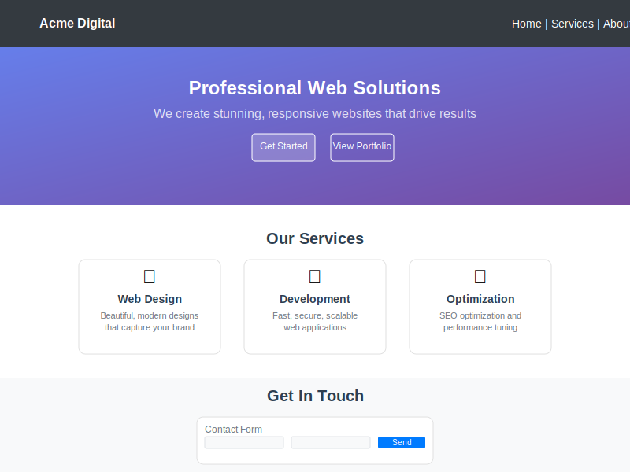

# 🌐 Basic Website Example

Create a complete, professional website with navigation, content sections, and contact form.

## Preview



## Complete Code

```python
from pypage import *

# Create the main page
page = Page(
    title="Acme Digital Agency", 
    description="Professional web design and development services",
    theme="bootstrap"
)

# Enable dark mode
page.add_content(DarkModeToggle(position="top-right"))

# Navigation
nav_links = [
    {"url": "#home", "text": "Home"},
    {"url": "#services", "text": "Services"},
    {"url": "#about", "text": "About"},
    {"url": "#contact", "text": "Contact"}
]
page.add_navbar(nav_links, brand="Acme Digital", dark=True, bg_color="dark")

# Hero Section
hero = Container([
    SlideUp(
        Div([
            Heading("Professional Web Solutions", 1, css_class="display-3 fw-bold text-white mb-4"),
            Paragraph(
                "We create stunning, responsive websites that drive results for your business.",
                css_class="lead text-white-50 mb-5"
            ),
            Div([
                Button("Get Started", "button", css_class="btn btn-primary btn-lg me-3"),
                Button("View Portfolio", "button", css_class="btn btn-outline-light btn-lg")
            ])
        ], css_class="text-center py-5")
    )
], css_class="bg-dark py-5", style={
    "background": "linear-gradient(135deg, #667eea 0%, #764ba2 100%)",
    "min-height": "80vh",
    "display": "flex",
    "align-items": "center"
})

page.add_content(hero)

# Services Section
services_section = Container([
    Div(id="services"),
    Heading("Our Services", 2, css_class="text-center mb-5"),
    Row([
        Column([
            FadeIn(
                Card([
                    Div("🎨", css_class="display-4 text-center text-primary mb-3"),
                    Heading("Web Design", 4, css_class="text-center"),
                    Paragraph(
                        "Beautiful, modern designs that capture your brand and engage your audience.",
                        css_class="text-center text-muted"
                    ),
                    Div([
                        Badge("UI/UX", "primary"),
                        Badge("Responsive", "secondary"),
                        Badge("Modern", "success")
                    ], css_class="text-center")
                ], css_class="h-100 border-0 shadow"),
                delay=100
            )
        ], width="md-4 mb-4"),
        
        Column([
            FadeIn(
                Card([
                    Div("⚡", css_class="display-4 text-center text-warning mb-3"),
                    Heading("Development", 4, css_class="text-center"),
                    Paragraph(
                        "Fast, secure, and scalable web applications built with modern technologies.",
                        css_class="text-center text-muted"
                    ),
                    Div([
                        Badge("React", "primary"),
                        Badge("Python", "secondary"),
                        Badge("Fast", "success")
                    ], css_class="text-center")
                ], css_class="h-100 border-0 shadow"),
                delay=200
            )
        ], width="md-4 mb-4"),
        
        Column([
            FadeIn(
                Card([
                    Div("🚀", css_class="display-4 text-center text-success mb-3"),
                    Heading("Optimization", 4, css_class="text-center"),
                    Paragraph(
                        "SEO optimization and performance tuning to maximize your online presence.",
                        css_class="text-center text-muted"
                    ),
                    Div([
                        Badge("SEO", "primary"),
                        Badge("Analytics", "secondary"),
                        Badge("Growth", "success")
                    ], css_class="text-center")
                ], css_class="h-100 border-0 shadow"),
                delay=300
            )
        ], width="md-4 mb-4")
    ])
], css_class="py-5")

page.add_content(services_section)

# Stats Section
stats_section = Container([
    Row([
        Column([
            Div([
                Heading("150+", 2, css_class="fw-bold text-primary mb-0"),
                Paragraph("Projects Completed", css_class="text-muted")
            ], css_class="text-center")
        ], width="md-3 mb-4"),
        
        Column([
            Div([
                Heading("98%", 2, css_class="fw-bold text-primary mb-0"),
                Paragraph("Client Satisfaction", css_class="text-muted")
            ], css_class="text-center")
        ], width="md-3 mb-4"),
        
        Column([
            Div([
                Heading("50+", 2, css_class="fw-bold text-primary mb-0"),
                Paragraph("Happy Clients", css_class="text-muted")
            ], css_class="text-center")
        ], width="md-3 mb-4"),
        
        Column([
            Div([
                Heading("24/7", 2, css_class="fw-bold text-primary mb-0"),
                Paragraph("Support Available", css_class="text-muted")
            ], css_class="text-center")
        ], width="md-3 mb-4")
    ])
], css_class="py-5 bg-light")

page.add_content(stats_section)

# About Section
about_section = Container([
    Div(id="about"),
    Row([
        Column([
            Heading("About Acme Digital", 2, css_class="mb-4"),
            Paragraph(
                "With over 10 years of experience in web design and development, "
                "we've helped hundreds of businesses establish their online presence "
                "and achieve their digital goals.",
                css_class="lead mb-4"
            ),
            Paragraph(
                "Our team of expert designers and developers work closely with each "
                "client to create custom solutions that not only look great but also "
                "perform exceptionally well.",
                css_class="mb-4"
            ),
            ProgressBar(95, label="Client Satisfaction", animated=True),
            ProgressBar(88, label="Project Success Rate", animated=True),
            ProgressBar(92, label="On-Time Delivery", animated=True)
        ], width="md-6"),
        
        Column([
            Image(
                "https://images.unsplash.com/photo-1522071820081-009f0129c71c?w=500", 
                "Team collaboration",
                css_class="img-fluid rounded shadow"
            )
        ], width="md-6")
    ])
], css_class="py-5")

page.add_content(about_section)

# Contact Section
contact_section = Container([
    Div(id="contact"),
    Heading("Get In Touch", 2, css_class="text-center mb-5"),
    Row([
        Column([
            Card([
                Heading("Contact Information", 4, css_class="mb-4"),
                Div([
                    Paragraph("📧 hello@acmedigital.com", css_class="mb-2"),
                    Paragraph("📞 +1 (555) 123-4567", css_class="mb-2"),
                    Paragraph("📍 123 Business St, Suite 100", css_class="mb-2"),
                    Paragraph("   San Francisco, CA 94105", css_class="mb-4 text-muted"),
                ]),
                Div([
                    Heading("Follow Us", 5, css_class="mb-3"),
                    Div([
                        Button("Twitter", "button", css_class="btn btn-outline-primary btn-sm me-2"),
                        Button("LinkedIn", "button", css_class="btn btn-outline-primary btn-sm me-2"),
                        Button("GitHub", "button", css_class="btn btn-outline-primary btn-sm")
                    ])
                ])
            ], css_class="h-100")
        ], width="md-4"),
        
        Column([
            Card([
                Heading("Send us a Message", 4, css_class="mb-4"),
                Form(action="/contact", method="POST", fields=[
                    Row([
                        Column([
                            Input("first_name", "text", placeholder="First Name", required=True)
                        ], width="md-6"),
                        Column([
                            Input("last_name", "text", placeholder="Last Name", required=True)
                        ], width="md-6")
                    ]),
                    Input("email", "email", placeholder="Email Address", required=True),
                    Input("company", "text", placeholder="Company (Optional)"),
                    Select("service", [
                        {"value": "web-design", "label": "Web Design"},
                        {"value": "development", "label": "Development"},
                        {"value": "optimization", "label": "SEO & Optimization"},
                        {"value": "consultation", "label": "Consultation"}
                    ], selected="web-design"),
                    TextArea("message", placeholder="Tell us about your project...", rows=4),
                    Button("Send Message", "submit", css_class="btn btn-primary w-100")
                ])
            ])
        ], width="md-8")
    ])
], css_class="py-5 bg-light")

page.add_content(contact_section)

# Footer
footer = Container([
    Row([
        Column([
            Heading("Acme Digital", 5, css_class="mb-3"),
            Paragraph(
                "Creating digital experiences that matter.",
                css_class="text-muted mb-3"
            ),
            Paragraph(
                "© 2024 Acme Digital Agency. All rights reserved.",
                css_class="text-muted small"
            )
        ], width="md-6"),
        
        Column([
            Heading("Quick Links", 5, css_class="mb-3"),
            Div([
                Link("Privacy Policy", "#", css_class="text-muted d-block mb-1"),
                Link("Terms of Service", "#", css_class="text-muted d-block mb-1"),
                Link("Cookie Policy", "#", css_class="text-muted d-block mb-1"),
                Link("Sitemap", "#", css_class="text-muted d-block mb-1")
            ])
        ], width="md-3"),
        
        Column([
            Heading("Services", 5, css_class="mb-3"),
            Div([
                Link("Web Design", "#", css_class="text-muted d-block mb-1"),
                Link("Development", "#", css_class="text-muted d-block mb-1"),
                Link("SEO Services", "#", css_class="text-muted d-block mb-1"),
                Link("Consulting", "#", css_class="text-muted d-block mb-1")
            ])
        ], width="md-3")
    ])
], css_class="py-5 bg-dark text-light")

page.add_content(footer)

# Add smooth scrolling CSS
page.custom_css = """
html {
    scroll-behavior: smooth;
}

.navbar-brand {
    font-weight: bold;
    font-size: 1.5rem;
}

.card {
    transition: transform 0.3s ease;
}

.card:hover {
    transform: translateY(-5px);
}
"""

# Run the website
if __name__ == "__main__":
    page.run(port=8000)
```

## Features Demonstrated

### 🎨 Design Elements
- **Hero section** with gradient background
- **Responsive grid** layout
- **Card components** for services
- **Navigation bar** with smooth scrolling
- **Contact form** with validation

### ✨ Animations
- **SlideUp** animation for hero content
- **FadeIn** animations for service cards
- **Hover effects** with CSS transitions

### 🛠️ Components Used
- `Page` - Main page container
- `Container` - Bootstrap containers
- `Row` / `Column` - Grid system
- `Card` - Content cards
- `Form` - Contact form
- `Navbar` - Navigation
- `Button` - Call-to-action buttons
- `Badge` - Technology tags
- `ProgressBar` - Statistics display

### 📱 Responsive Features
- Mobile-first design
- Bootstrap breakpoints
- Flexible grid layout
- Responsive navigation

## Customization Options

### Change Colors
```python
# Update the hero gradient
hero = Container([...], style={
    "background": "linear-gradient(135deg, #ff6b6b 0%, #4ecdc4 100%)",
    # ... other styles
})
```

### Add More Sections
```python
# Portfolio section
portfolio_section = Container([
    Heading("Our Work", 2, css_class="text-center mb-5"),
    Row([
        Column([
            Card([
                Image("project1.jpg", "Project 1"),
                Heading("E-commerce Platform", 5),
                Paragraph("Modern online store with advanced features")
            ])
        ], width="md-4")
        # Add more portfolio items...
    ])
])
```

### Integrate with Backend
```python
# Use with Flask
from flask import Flask

app = Flask(__name__)

@app.route('/')
def home():
    return page.generate_html()

@app.route('/contact', methods=['POST'])
def contact():
    # Handle form submission
    return "Thank you for your message!"
```

This example demonstrates how to create a complete, professional website using PyPage components with modern design patterns and interactive features.